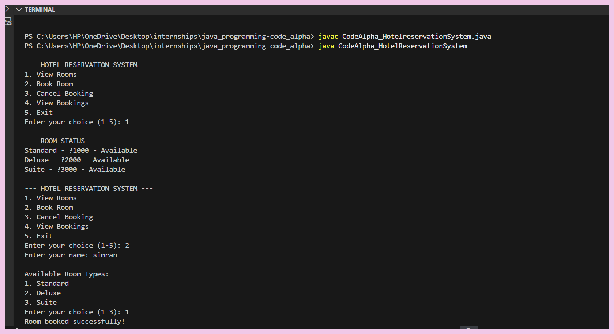
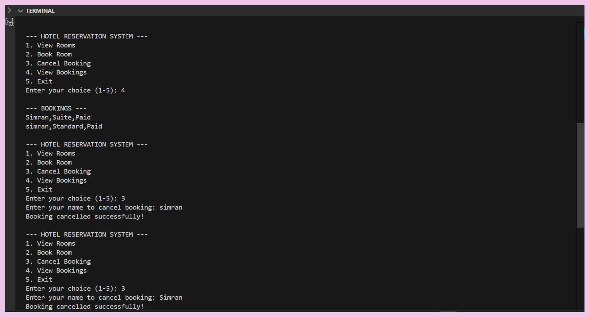
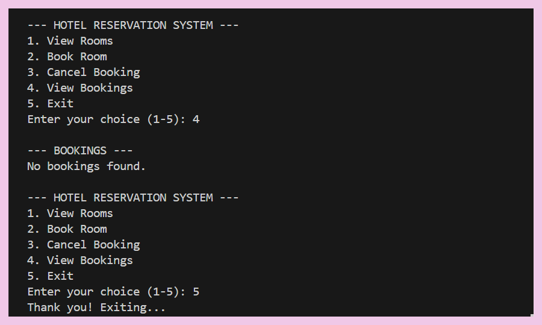

# 🏨 Hotel Reservation System

This is a Java console-based application developed as part of the CodeAlpha Internship.  
It allows users to manage hotel room bookings efficiently using a simple menu-driven system.

---

## 🚀 Features

- View available rooms (Standard, Deluxe, Suite)
- Book a room with user-friendly input
- Cancel existing bookings
- View all booking records
- Payment simulation included
- File handling using `bookings.txt`
- Input validation for better user experience

---

## 💻 Technologies Used

- Java
- OOP (Object-Oriented Programming)
- File Handling
- Console-based Interface

---

## ▶️ How to Run

1. Compile the program:

## 📸 Output

